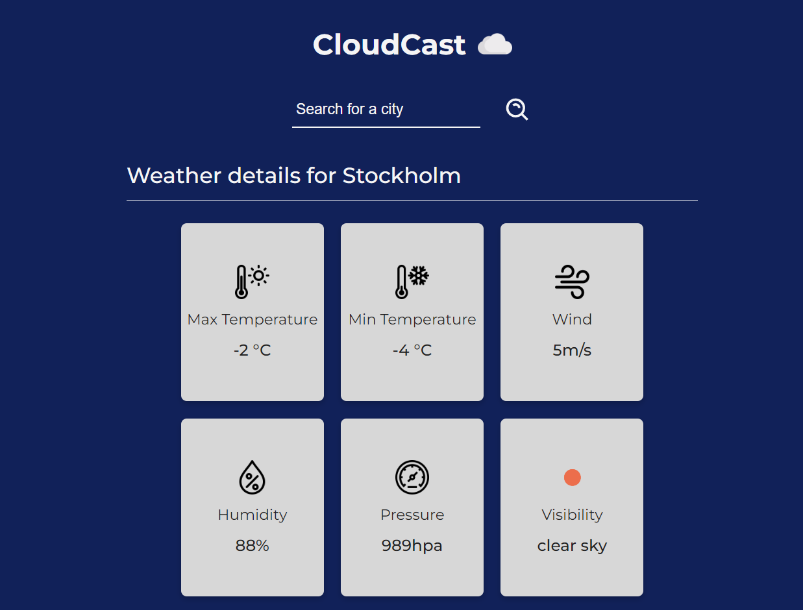

# CloudCast
A weather app using using API from [OpenWeather](https://openweathermap.org/) and map from [Leaflet](https://leafletjs.com/). The webapplication is built with JavaScript, React, TypeScript and SASS, including a package-based architecture.

## Web app
https://cloud-cast-nine.vercel.app/
